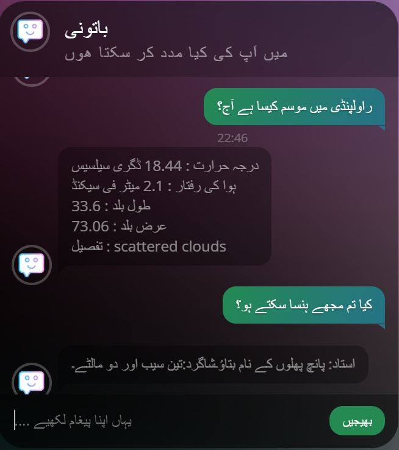
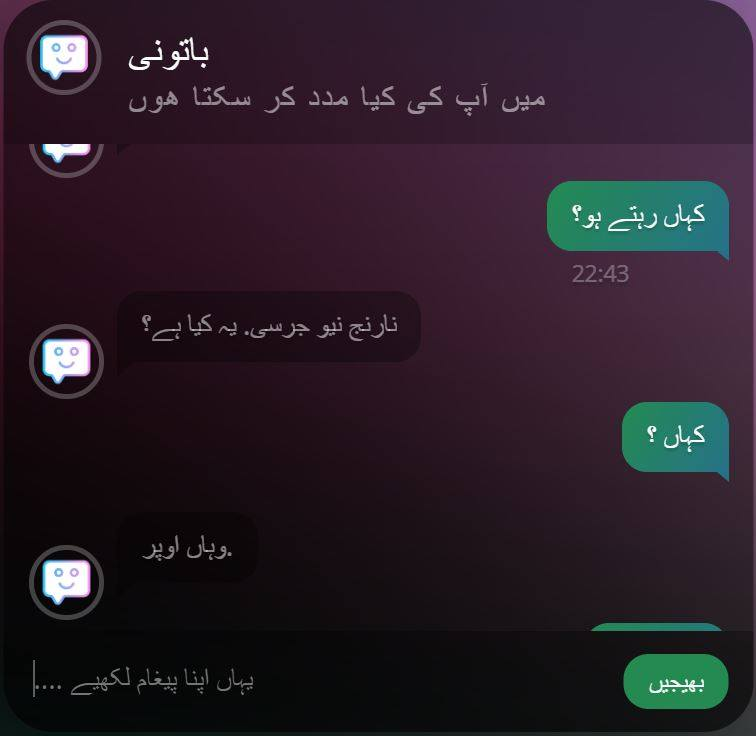
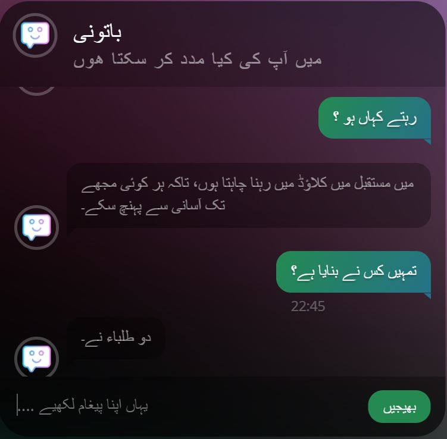

# Seq2Seq-UrduChatBot
A Sequence to Sequence Model Implementation of Urdu Natural Language Processing. Below is the link to download the windows installer. Make sure to install the prequisites before installing. After Installation run the app by the Icon from the desktop and after 40 seconds referesh the page which is opened in your browser.
- [Urdu Chatbot Windows App](https://drive.google.com/open?id=1Xu12QRpuzE8g37PnZRvLgia7AwO08cjf)
# seq2seq-chatbot
A sequence2sequence chatbot implementation with TensorFlow. Here are some responses.






To run this program successfully the following requirements mustbe fullfilled.
Anaconda with Python 3.6 or higher
Tensorflow Version 1.13.1

1. Anaconda. 
	Download Anaconda from https://www.anaconda.com/distribution/
	Install Anaconda

2. Tensorflow 1.13.1
	If you already installed the anaconda and tensorflow. Check version of your Tensorflow Installation.
	Open Anaconda Prompt and write 'python' and hit enter.
	Python command line interface will open. In there write following python lines to check your version of Tensorflow.
	>>>import tensorflow as tf
	>>>print(tf.__version__)
	If the result is 1.13.1 then you are good to go. Just Double Click the 'Urdu Virtual Assistant' icon on your desktop.
	If the webpage is not loaded wait for 20 seconds and reload the page or hit the F5 key.

	If the version of your Tensorflow Installation is not 1.0.0 then you have to uninstall your current Tensorflow.
	Open Anaconda Prompt and write the following command.
	```shell
	pip uninstall tensorflow
	```
	You will be asked to 'Procees (y/n)?' enter 'y' and hit enter key.
	After uninstallation enter the following command in Anaconda Prompt to Install Tensorflow 1.13.1
	```shell
	pip install tensorflow==1.13.1
	```
	and hit enter.
	After installation Just Double Click the 'Urdu Virtual Assistant' icon on your desktop.
	If the webpage is not loaded wait for 20-40 seconds and reload the page or hit the F5 key.

## Dependencies
The following python packages are used in seq2seq-chatbot:
(excluding packages that come with Anaconda)

- [googletrans](https://github.com/ssut/py-googletrans)
   ```shell
    pip install googletrans
    ```0

- [jsonpickle](https://jsonpickle.github.io/)
    ```shell
    pip install --upgrade jsonpickle
    ```

- [click 6.7](https://palletsprojects.com/p/click/), [flask 0.12.4](http://flask.pocoo.org/) and [flask-restful](https://flask-restful.readthedocs.io/en/latest/) (required to run the web interface)
    ```shell
    pip install click==6.7
    pip install flask==0.12.4
    pip install --upgrade flask-restful
    ```
- [TensorFlow](https://www.tensorflow.org/)
    ```shell
    pip install --upgrade tensorflow
    ```
    For GPU support: [(See here for full GPU install instructions including CUDA and cuDNN)](https://www.tensorflow.org/install/)
    ```shell
    pip install --upgrade tensorflow-gpu
    ```


## Relevant papers
1. [Sequence to Sequence Learning with Neural Networks](https://arxiv.org/abs/1409.3215)

2. [A Neural Conversational Model](https://arxiv.org/abs/1506.05869)

3. [Neural Machine Translation by Jointly Learning to Align and Translate](https://arxiv.org/abs/1409.0473) (Bahdanau attention mechanism)

4. [Effective Approaches to Attention-based Neural Machine Translation](https://arxiv.org/abs/1508.04025) (Luong attention mechanism)

